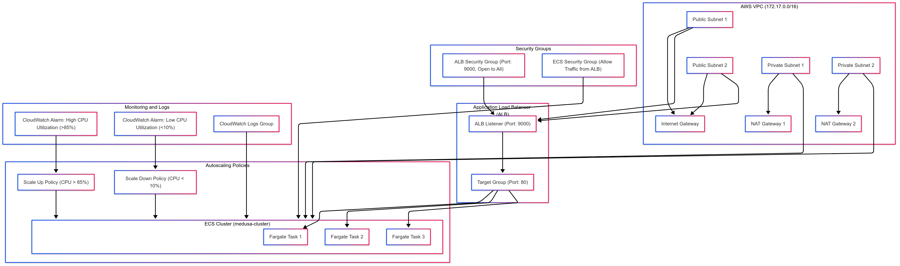
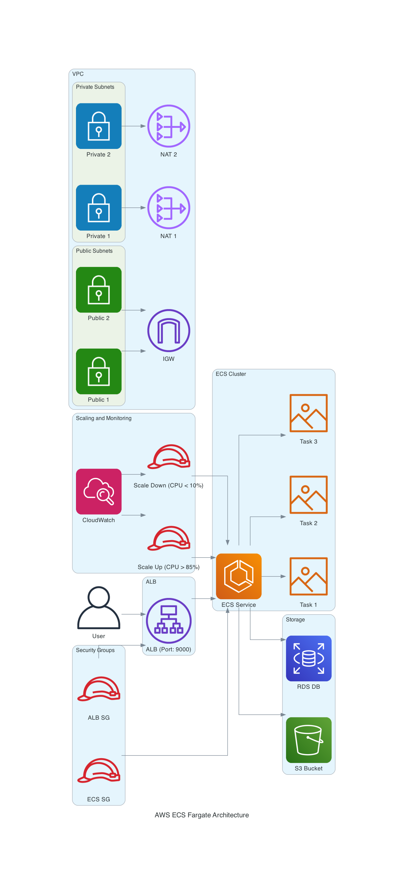

# AWS ECS Fargate Architecture

## Overview

This setup deploys an application using AWS ECS Fargate, providing a fully managed, scalable environment for containerized applications. The architecture includes everything needed to run a scalable application, such as an Application Load Balancer (ALB), ECS Cluster, CloudWatch for monitoring, Auto Scaling, and secure networking. All of this is provisioned using Terraform.

## Key Components

### 1. **VPC and Subnets**
   - **VPC**: A Virtual Private Cloud (VPC) with a CIDR block of `172.17.0.0/16` to create the network boundary.
   - **Subnets**: 
     - Public subnets are used for the ALB and internet access.
     - Private subnets host the ECS tasks, ensuring secure communication without direct exposure to the internet.

### 2. **ECS Cluster and Tasks**
   - **ECS Cluster**: A cluster named `medusa-cluster` that runs your containerized application.
   - **ECS Service**: The service is configured to use Fargate as the launch type, running a defined number of containers based on the `app_count` variable. 
     - **Docker Image**: It uses the image `saipraveenn/medusa-ecs-fargate:latest`, but this can be customized.
     - **Auto Scaling**: ECS tasks are automatically scaled based on CPU utilization.

### 3. **Application Load Balancer (ALB)**
   - The ALB directs incoming traffic on port 9000 to the ECS tasks.
   - Health checks ensure that traffic only goes to healthy tasks.

### 4. **Security Groups**
   - **ALB Security Group**: Controls access to the ALB, allowing traffic on the specified port (default: 9000).
   - **ECS Security Group**: Only allows traffic from the ALB to ECS tasks, ensuring a secure environment.

### 5. **CloudWatch Monitoring and Auto Scaling**
   - **CloudWatch Alarms**: Monitors CPU utilization to trigger auto-scaling policies.
   - **Auto Scaling**: ECS tasks are scaled up or down based on CPU usage, maintaining efficiency and saving costs.

### 6. **Networking**
   - **NAT Gateways**: Provide private subnets with internet access while keeping the tasks secure.
   - **Internet Gateway**: Allows public subnets to access the internet, especially for the ALB.

---

## Terraform Configuration Files

### `variables.tf`
Contains the variables used across the configuration, such as:
- AWS region
- ECS roles and policies
- Application settings like Docker image, port, and scaling options

### `ecs.tf`
Defines the ECS cluster, task definitions, and ECS service configuration. It includes:
- **Task Definitions**: Specifies the Docker image, CPU, and memory settings.
- **IAM Roles**: Configures the necessary permissions for ECS to interact with other AWS services.

### `alb.tf`
Sets up the Application Load Balancer, target groups, and listeners to route traffic to ECS tasks.

### `autoscaling.tf`
Defines the auto-scaling setup, including roles and scaling policies. This ensures the application can scale automatically based on CPU usage.

### `logs.tf`
Sets up CloudWatch logs to capture and monitor ECS task logs for better visibility into your application's performance.

### `network.tf`
Defines the networking aspects, including:
- VPC, subnets, and route tables
- NAT Gateways for private subnet internet access
- Internet Gateway for public subnet access

### `outputs.tf`
Outputs the DNS name of the ALB so you can easily access your deployed application.

### `provider.tf`
Configures the AWS provider with the required region to provision resources.

### `security.tf`
Configures security groups for the ALB and ECS tasks, ensuring controlled access between components.

---

## Architecture Diagram

The architecture diagram below shows the flow of components:

- **VPC** with Public and Private Subnets.
- **ALB** distributing traffic to ECS tasks.
- **Auto Scaling** manages ECS task counts based on CPU load.
- **CloudWatch** monitoring system health.

---

## Requirements

- **AWS Account**: You need an AWS account with sufficient permissions to create ECS, VPC, ALB, IAM roles, CloudWatch, and Auto Scaling resources.
- **Terraform**: Version 1.0 or later should be installed.

---

## Setup Instructions

1. Clone the repository or create a directory for your Terraform files.
2. Initialize Terraform by running:
   
   `terraform init`
   
4. Apply the Terraform configuration to provision the resources:
   
   `terraform apply`

6. Review the resources that will be created and type `yes` to confirm.
7. Once applied, Terraform will output the ALB’s DNS name. You can use this to access your application.

---

## Customization

- Change the values in `variables.tf` to fit your needs:
- **app_image**: Docker image to use for the ECS tasks.
- **app_count**: Number of containers to deploy.
- **fargate_cpu** and **fargate_memory**: Adjust resource allocation for the containers.
- **Scaling**: Modify the auto-scaling policies in `autoscaling.tf` to adjust when your application scales up or down.

---

## Cleanup

To remove the deployed resources and avoid ongoing charges, run:

`terraform destroy`
